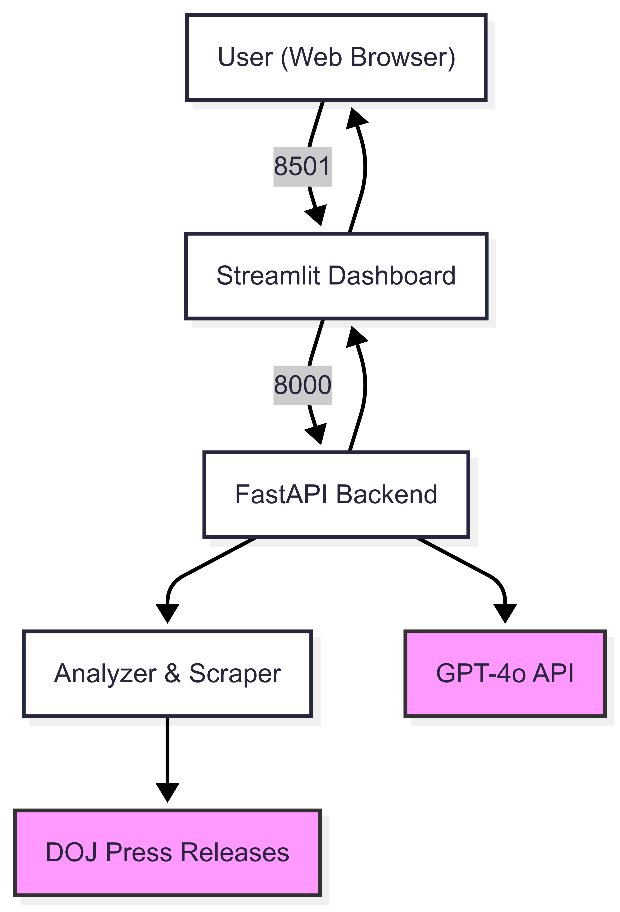

<div align="center">

# DOJ Legal Fraud Research Agent

[](LICENSE)

</div>

A end to end system for automatically analyzing and categorizing DOJ press releases, with a focus on fraud detection and legal research. It provides a dashboard, API, and CLI for exploring and summarizing DOJ cases.

---

## Motivation
This project was built to help my husband, a legal researcher, efficiently categorize and analyze fraud cases from the DOJ website. The goal is to save time, improve accuracy, and make legal research on fraud trends more accessible and reproducible.

If you're a legal researcher (or just curious about DOJ fraud cases), feel free to use this tool, share it with colleagues, or suggest improvements. Pull requests and feedback are always welcome—let's make legal research a little easier for everyone!

---

## Architecture


*System architecture: User interacts with Streamlit Dashboard, which communicates with a FastAPI backend for scraping, analysis, and GPT-4o-powered fraud detection.*

---

## Features
- **Automated scraping** of DOJ press releases
- **Fraud detection** using both rule-based and GPT-4o (OpenAI) logic
- **Charge and category extraction** for each case
- **Streamlit dashboard** for interactive exploration and CSV export
- **FastAPI backend** for scalable, async analysis jobs
- **CLI tools** for batch analysis and summary reports
- **Docker Compose** support for easy deployment

---

## Requirements
- Python 3.12+
- [Poetry](https://python-poetry.org/) for dependency management
- Docker & Docker Compose (for containerized deployment)
- OpenAI API key (for GPT-4o extraction, if enabled)

---

## Getting Started

### 1. **Clone the repository**
```bash
git clone https://github.com/Alicelibinguo5/doj-case-research-agent.git
cd doj-case-research-agent
```

### 2. **Local Development (Poetry)**
```bash
poetry install
poetry shell
# Set your OpenAI API key if using GPT-4o
export OPENAI_API_KEY=sk-...
# Run the Streamlit dashboard
streamlit run app/streamlit_agent.py
```

### 3. **Run with Docker Compose (Recommended)**
```bash
docker compose build
docker compose up
```
- Access the dashboard at [http://localhost:8501](http://localhost:8501)
- The FastAPI backend runs at [http://localhost:8000](http://localhost:8000)

### 4. **(Optional) CLI Usage**
```bash
python -m doj_research_agent.cli analyze --max-pages 5 --max-cases 20
python -m doj_research_agent.cli summary output/your_analysis.json
```

---

## Configuration
- **Max Pages / Max Cases:** Set via the dashboard or CLI to control scraping limits.
- **Fraud Type Filtering:** Analyze by specific fraud category (e.g., financial_fraud, tax, etc.).
- **OpenAI API Key:** Required for GPT-4o extraction. Set `OPENAI_API_KEY` in your environment.

---

## Troubleshooting
- **Docker Compose:** Use `docker compose logs backend` and `docker compose logs frontend` to debug issues.
- **Dependency Issues:** Ensure all dependencies are in `pyproject.toml` and run `poetry update` if needed.
- **Backend Connection Errors:** Make sure both backend and frontend containers are running and use the correct `BACKEND_URL`.
- **Missing Packages:** Add any missing Python packages to `pyproject.toml` and rebuild.

---

## Contributing
Pull requests and issues are welcome! Please see [CONTRIBUTING.md](CONTRIBUTING.md) if available.

---

## License
This project is licensed under the MIT License. See [LICENSE](LICENSE) for details.

---

## Acknowledgments
- U.S. Department of Justice for public press release data
- OpenAI for GPT-4o API
- Streamlit, FastAPI, Poetry, and the Python open-source community
